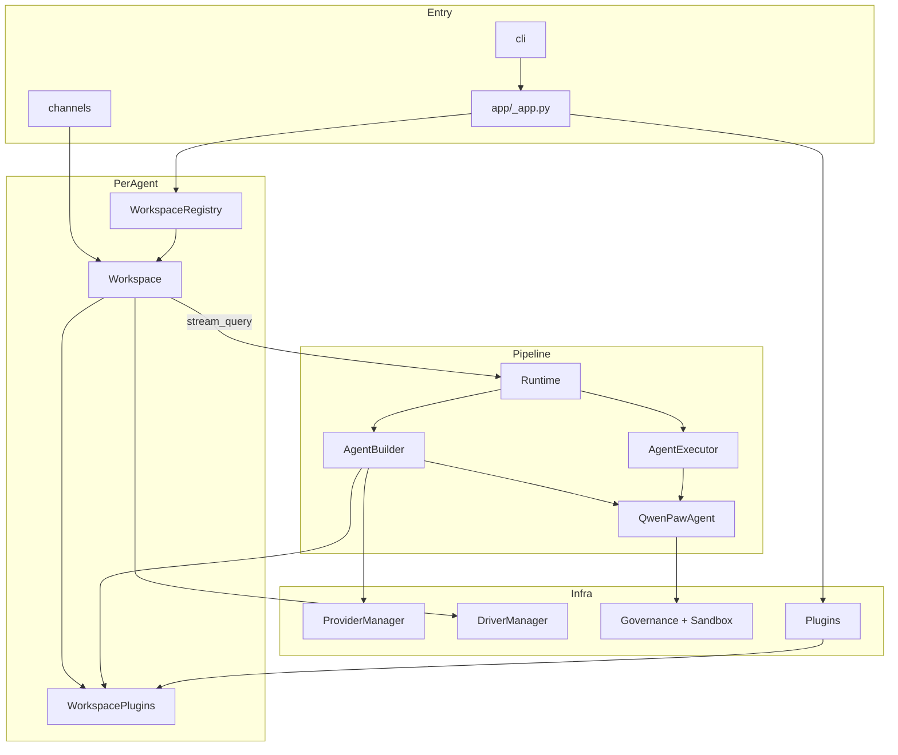

# 01 · 架构总览

QwenPaw 是运行在用户本机的**智能体操作系统（Agent OS）**：一次安装可托管多个相互隔离的 Agent；每个 Agent 对应一个 **Workspace**；每个请求由 **Runtime** 编排，在治理与沙箱之下串联模型、工具、记忆、Skills 与外部连接器。

底层内核是进程内的 [AgentScope 2.0](https://github.com/agentscope-ai/agentscope)（ReAct 循环、会话状态、事件流、工具层）。QwenPaw 在其上构建 OS 层：工作区资源、信任主干（治理 + 沙箱）、多通道入口与可插拔扩展。

---

## 分层视图

```
┌─────────────────────────────────────────────────────────────┐
│  入口层                                                      │
│  Channels (IM) · Console (Web) · TUI · CLI · ACP · Cron     │
└────────────────────────────┬────────────────────────────────┘
                             ▼
┌─────────────────────────────────────────────────────────────┐
│  运行时层（请求调度）                                          │
│  WorkspaceRegistry → Workspace → Runtime（8 Phase）          │
│  HookRegistry · SlashCommand · AgentBuilder · AgentExecutor │
└────────────────────────────┬────────────────────────────────┘
                             ▼
┌─────────────────────────────────────────────────────────────┐
│  Agent 层                                                    │
│  QwenPawAgent (ReAct) · Modes · Loop Gates · Middlewares    │
│  Tools · Skills · Memory · Context (Scroll)                 │
└────────────────────────────┬────────────────────────────────┘
                             ▼
┌─────────────────────────────────────────────────────────────┐
│  信任主干                                                     │
│  ToolGuard → ResourceGovernor → Approval → Sandbox          │
└────────────────────────────┬────────────────────────────────┘
                             ▼
┌─────────────────────────────────────────────────────────────┐
│  连接层                                                       │
│  Providers (LLM) · Drivers (MCP/…) · Credentials            │
└────────────────────────────┬────────────────────────────────┘
                             ▼
┌─────────────────────────────────────────────────────────────┐
│  基座 · AgentScope 2.0                                       │
└─────────────────────────────────────────────────────────────┘
```

---

## 核心概念

| 概念 | 含义 | 源码锚点 |
|------|------|----------|
| **Workspace** | 单个 Agent 的隔离边界：磁盘目录 + 运行时服务 | `app/workspace/workspace.py` |
| **WorkspaceRegistry** | 多 Agent 注册表；按 `agent_id` 懒加载 Workspace | `app/workspace_registry.py` |
| **Runtime** | 单次请求的 8 阶段编排器 | `runtime/runtime.py` |
| **AgentBuilder** | 每请求组装 `QwenPawAgent`（依赖注入） | `runtime/builder.py` |
| **QwenPawAgent** | 基于 AgentScope `Agent` 的 ReAct 智能体 | `agents/react_agent.py` |
| **Loop Gate** | 每轮推理后的停止/继续决策 | `loop/gates/` |
| **AgentMode** | Coding / Goal / Mission 能力包 | `modes/` |
| **Driver** | 协议中立的外部能力（当前以 MCP 为主） | `drivers/` |
| **Provider** | LLM 供应商抽象 | `providers/` |
| **Channel** | 人对 Agent 的入口（IM / Console 等） | `app/channels/` |

---

## 模块依赖（简化）



---

## 设计原则（从代码中提炼）

1. **薄 Agent，厚 Builder**  
   `QwenPawAgent` 不在内部拼装 model/toolkit；一律由 `AgentBuilder` 注入，便于测试与替换。

2. **请求级编排 ≠ Agent 内循环**  
   Runtime Hook（8 Phase）管整次请求；AgentScope Middleware 管单次 `reply_stream`。两者正交。

3. **信任主干统一入口**  
   工具执行必经 `PolicyGuardedTool` → 策略评估 → 可选审批 → 沙箱，而不是散落在各工具函数里。

4. **Workspace 即隔离单位**  
   文件、记忆、会话、Driver、插件注册表按 Agent 隔离；跨 Agent 通信需显式发生。

5. **可组合扩展**  
   Modes / Hooks / Plugins / Drivers 都通过注册表挂接，避免改核心循环。

---

## 版本与基座

| 项 | 值 |
|----|-----|
| 包版本 | `2.0.0`（`__version__.py`） |
| AgentScope | `agentscope==2.0.4` |
| 长期记忆 | `reme-ai==0.4.0.9` |
| Python | `>=3.11,<3.14` |

下一篇：[目录结构](./02-directory-structure.md)
