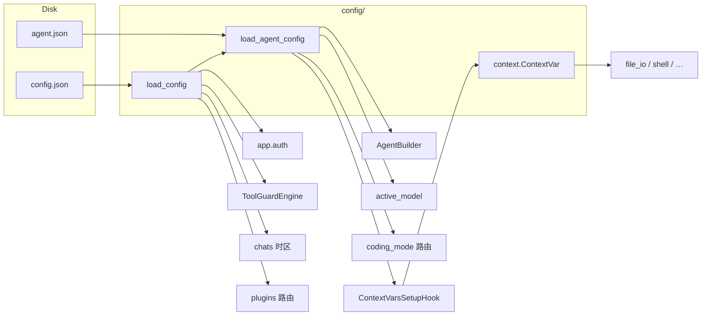

# 11 · Config 模块

`config/` 是 QwenPaw 的**配置契约层**：用 Pydantic 模型描述磁盘上的 JSON，提供带 mtime 缓存的读写，并把每请求运行时参数通过 `ContextVar` 注入工具。它**不**持有 LLM 密钥（那是 `SECRET_DIR/providers.json`），也**不**持有治理策略（那是 `governance/{ws_hash}/policy.yaml`）。

**路径：** `src/qwenpaw/config/`

| 文件 | 职责 |
|------|------|
| `__init__.py` | 对外导出模型与 `load_config` / `save_config` 等 |
| `config.py` | Pydantic 模型树 + Agent 配置读写 + 遗留迁移 |
| `utils.py` | 根 `config.json` 的 load/save/校验、浏览器探测、路径辅助 |
| `context.py` | 工具可见的 `ContextVar`（workspace / shell / toolkit…） |
| `timezone.py` | 独立 IANA 时区探测，避免 `config.py` ↔ `utils.py` 循环导入 |

用户侧字段说明见官网 [`config.zh.md`](../website/public/docs/config.zh.md)；本文只讲源码如何落地。

---

## 1. 两层配置

多智能体之后，配置刻意拆成「根引用 + 工作区全量」：

```
WORKING_DIR/config.json          # Config：进程级 + Agent 引用表
WORKING_DIR/workspaces/{id}/
  └── agent.json                 # AgentProfileConfig：该 Agent 的完整配置
SECRET_DIR/providers.json        # 不在本模块（ProviderManager）
governance/{ws_hash}/policy.yaml # 不在本模块（ResourceGovernor）
```

`WORKING_DIR` 解析顺序（`constant.py`）：

1. `QWENPAW_WORKING_DIR` / `COPAW_WORKING_DIR`
2. 已存在的 `~/.copaw`（CoPaw 遗留安装）
3. 默认 `~/.qwenpaw`

### 根配置：`Config`

```2099:2128:src/qwenpaw/config/config.py
class Config(BaseModel):
    """Root config (config.json)."""

    channels: ChannelConfig = ChannelConfig()
    mcp: MCPConfig = MCPConfig()
    tools: ToolsConfig = Field(default_factory=ToolsConfig)
    last_api: LastApiConfig = LastApiConfig()
    agents: AgentsConfig = Field(default_factory=AgentsConfig)
    last_dispatch: Optional[LastDispatchConfig] = None
    security: SecurityConfig = Field(default_factory=SecurityConfig)
    acp: ACPConfig = Field(default_factory=ACPConfig)
    show_tool_details: bool = True
    user_timezone: str = Field(
        default_factory=detect_system_timezone,
        ...
    )
    plugins: Dict[str, Dict[str, Any]] = Field(default_factory=dict, ...)
    skill_paths: List[str] = Field(default_factory=list, ...)
```

`AgentsConfig.profiles` 只存引用，不存运行参数：

```1346:1363:src/qwenpaw/config/config.py
class AgentProfileRef(BaseModel):
    """Agent Profile reference (stored in root config.json)."""

    id: str
    workspace_dir: str
    enabled: bool = True
```

根上仍保留 `agents.running` / `llm_routing` / `language` 等 **legacy 字段**（带默认值），目的是：新版本写出的 `config.json` 旧版本还能读。真正生效的运行配置在 `agent.json`。

### Agent 配置：`AgentProfileConfig`

```1393:1477:src/qwenpaw/config/config.py
class AgentProfileConfig(BaseModel):
    """Complete Agent Profile configuration (stored in workspace/agent.json)."""

    id: str
    name: str
    description: str = ""
    workspace_dir: str = ""
    template_id: Optional[str] = None
    channels: Optional[ChannelConfig] = None
    mcp: Optional[MCPConfig] = None
    heartbeat: Optional[HeartbeatConfig] = None
    last_dispatch: Optional[LastDispatchConfig] = None
    running: AgentsRunningConfig
    llm_routing: AgentsLLMRoutingConfig
    active_model: Optional[ModelSlotConfig] = None
    language: str = "zh"
    approval_level: str = "AUTO"
    system_prompt_files: List[str]
    tools: Optional[ToolsConfig] = None
    security: Optional[SecurityConfig] = None
    acp: Optional[ACPConfig] = None
    plan: PlanConfig
    coding_mode: CodingModeConfig
```

热路径（`AgentBuilder.build`、通道、Cron）一律走 `load_agent_config(agent_id)`，再读 `running` / `active_model` / `tools`。根 `Config` 主要用于：Agent 列表、插件开关、时区、`last_api`、全局 security 回退。

---

## 2. 模型树

```
Config
├── ChannelConfig                    extra="allow"（插件通道可塞未知 key）
│   └── BaseChannelConfig            enabled / ACL / mute / debounce
│       └── Discord / Feishu / Slack / OneBot / …（18 个内置）
├── MCPConfig.clients[name]
│   └── MCPClientConfig              stdio | streamable_http | sse
│       └── MCPOAuthConfig
├── ToolsConfig.builtin_tools[name]
│   └── BuiltinToolConfig            enabled / icon / async_execution
├── AgentsConfig
│   ├── profiles[id] → AgentProfileRef
│   └── （legacy）running / llm_routing / language / audio_mode
├── SecurityConfig
│   ├── ToolGuardConfig
│   ├── FileGuardConfig
│   └── SkillScannerConfig
├── ACPConfig.agents[name] → ACPAgentConfig
├── last_api / last_dispatch / plugins / skill_paths / user_timezone
└── （磁盘上的 agent.json 对应）AgentProfileConfig
    ├── running: AgentsRunningConfig
    │   ├── loop: LoopConfig         iteration / doom_loop / rubric
    │   ├── light_context_config     native | scroll
    │   ├── reme_light_memory_config
    │   ├── llm_* 重试与限流
    │   └── shell_command_*
    ├── llm_routing                  local_first | cloud_first + 双 slot
    ├── active_model                 provider_id + model
    └── plan / coding_mode / heartbeat / tools / security / mcp / channels
```

### 运行时核心：`AgentsRunningConfig`

单 Agent 行为几乎都挂在这里：ReAct `max_iters`、Loop Gates、LLM 重试/QPM、shell 超时与解释器、上下文窗口、`light` 上下文（含 Scroll）、记忆后端（默认 `remelight`）。

`approval_level` 在 `AgentProfileConfig` 与 `AgentsRunningConfig` **各有一份**：running 上的字段是 API 代理位，写入时回写 profile（见字段 description）。治理层实际读的是 profile 上的 `STRICT | SMART | AUTO | OFF`。

### 合并默认值，而不是覆盖

若干容器在 `model_validator(mode="after")` 里把**代码新增的默认项**补进用户已保存的 JSON，避免升级后缺 key：

| 模型 | 策略 |
|------|------|
| `ACPConfig._merge_default_agents` | 用户没配的内置 ACP agent（opencode / qwen_code / claude_code / codex）补上 |
| `ToolsConfig._merge_default_tools` | 新内置工具补进 `builtin_tools`；`icon is None` 用默认图标填上 |
| `MCPConfig` | 默认带一条禁用的 `tavily_search` |
| `ChannelConfig` | `extra="allow"`，插件通道字段不被丢掉 |

`_default_builtin_tools()` 还会尝试从 `PluginRegistry` 拉插件声明的 tool name；插件尚未加载时静默退回硬编码集合。

工具预设（创建 Agent 模板用，不是运行时合并）：

- `build_qa_agent_tools_config()` — QA 模板：只开 shell + 文件 + `view_image`
- `build_local_agent_tools_config()` — 本地协作模板：再开 `list_agents` / `chat_with_agent` / `submit_to_agent` / `check_agent_task`

调用点：`agents/templates.py`。

### MCP 字段别名

`MCPClientConfig` 在 `mode="before"` 里把第三方示例常见写法归一化：`isActive`→`enabled`、`baseUrl`→`url`、`type`→`transport`，以及 `streamable-http` / `http` 等别名。`mode="after"` 再按 transport 校验：stdio 必须有 `command`，HTTP/SSE 必须有 `url`。校验失败抛 `ConfigurationException(config_key=...)`。

---

## 3. 读写与缓存

### 根配置 `load_config` / `save_config`

**路径：** `config/utils.py`

```
load_config()
  → get_config_path() = WORKING_DIR/config.json
  → 无文件 / stat 失败 → Config() 默认值
  → mtime 未变 → 返回进程内缓存
  → _read_config_data()
       json.loads；失败则 json_repair
       仍失败 → 备份 *.bak，返回 None
  → _load_and_validate_config()
       改写 ~/.copaw 绑定路径
       last_api_host/port → last_api
       Config.model_validate
       ValidationError → 删掉出错字段再试一次
       仍失败 → 备份，返回 Config()
       成功 → 磁盘上 weixin→wechat 一次性改写
  → 写入 (_config_cache, _config_mtime)
```

缓存是**模块级单例** + `threading.Lock`。`save_config` 写盘后把缓存置 `None`，下次 `load_config` 强制重读。

`strict_validate_config_file()` 给 `qwenpaw doctor` 用：同样走 repair 读 JSON，但**不做**删字段自愈，校验失败返回错误列表。

### Agent 配置 `load_agent_config` / `save_agent_config`

**路径：** `config/config.py`（缓存字典却定义在 `utils.py`，双方互相 import，用函数内延迟导入打破环）。

```
load_agent_config(agent_id)
  → load_config()，profiles 里必须有该 id
  → workspace/agent.json 不存在或不可 stat
       → build_fallback_agent_profile_config() 从根 Config 拷 channels/mcp/tools/security/running
       → save_agent_config 落盘
  → mtime 命中 _agent_config_cache → 直接返回
  → json.load
  → 一次性迁移：channels.weixin → wechat（改磁盘）
  → 一次性迁移：dm_policy / group_policy / allow_from → access_control.json（改磁盘）
  → _normalize_working_dir_bound_paths（仅内存，不回写）
  → sanitize_mcp_clients：坏的 MCP 条目丢掉，不让整份 agent.json 加载失败
  → AgentProfileConfig(**data) 写入缓存
```

`save_agent_config` 用 `model_dump(exclude_none=True)` 写 `agent.json`，并删除该 `agent_id` 的缓存项。

**注意：** `load_config` 的 JSON 自愈（删坏字段 / repair）**没有**同等应用到 `agent.json`。Agent 侧只对 MCP 做 skip；其余字段校验失败会直接抛。

### `last_api` 双缓存

桌面端随机端口时，磁盘上的 `last_api` 可能被迁移或文件锁写乱。`utils.py` 另有进程内 `_runtime_last_api`：

1. `write_last_api(host, port)` 同时写内存与 `config.json`
2. `read_last_api()` 优先内存，再回退磁盘
3. `is_qwenpaw_running()` 用该地址做 TCP `connect_ex`

注释约定：仅启动线程写、多线程读，依赖 CPython GIL，当前不加锁。

---

## 4. 兼容与迁移

配置模块承担大量「旧安装仍能启动」的工作，按触发时机分类：

| 时机 | 行为 |
|------|------|
| 读根 JSON | `json_repair`；校验失败删字段；备份 `.bak` |
| 读根 / agent JSON | `channels.weixin` → `wechat`（改磁盘 + `.weixin-migrate.bak`） |
| 读任意 JSON | `workspace_dir` / `media_dir` 中 `~/.copaw` 前缀改写为当前 `WORKING_DIR`（agent.json **只改内存**） |
| 读 agent.json | `dm_policy=allowlist` → `access_control_dm`；`disabled` → `dm_disabled`；`allow_from` 导入 `access_control.json` |
| MCP | 别名归一；非法 client 从 dict 删除 |
| 启动迁移函数 | `migrate_legacy_config_to_multi_agent()`：单 Agent 根配置拆出 `workspaces/default/agent.json`，并拷 sessions/memory/markdown |
| 缺 agent.json | `build_fallback_agent_profile_config`（`doctor fix` 共用，保证默认一致） |

`MCPClientConfig` 与 `HeartbeatConfig` 使用 `populate_by_name` / 字段 `alias`（如 `timeoutSeconds`），新旧 key 都能进模型。

Agent ID 规则（创建时，不是 Pydantic 字段约束）：`sanitize_agent_id` 只 strip；`validate_agent_id` 检查 2–64 字符、`[A-Za-z0-9_-]`、不能首尾为 `-`/`_`、保留字 `default`、与已有 id 不冲突。新 id 可用 `generate_short_agent_id()`（6 位 shortuuid）。

---

## 5. 请求期 ContextVar（`context.py`）

工具函数拿不到 `Workspace` 实例，通过 `contextvars.ContextVar` 读「当前请求」的工作区与限制。与 `app/agent_context.py` **分成两套**：

| 模块 | 变量 | 消费者 |
|------|------|--------|
| `config.context` | `workspace_dir`、`recent_max_bytes`、`shell_command_timeout`、`shell_command_executable`、`session_id`、`toolkit` | `file_io`、`shell`、Skill、ToolGuard、ACP 委托 |
| `app.agent_context` | `agent_id`、`channel`、`user_id`、`session_id`、`root_session_id` | HTTP / 通道 / 会话路由 |

注入点：`hooks/request_setup/contextvars_hook.py`（`Phase.PRE_DISPATCH`，priority 10）。它会：

1. 写入 workspace / session（**两套** session ContextVar 都 set）
2. `load_agent_config` 后写入 pruning 的 `pruning_recent_msg_max_bytes`、shell 超时与可执行文件

`current_toolkit` 供 `run_tool_batch` 取当前 `Toolkit`；setter 目前几乎未被调用，属于预留注入点。

---

## 6. 时区（`timezone.py`）

单独成文件，只依赖标准库，失败永不抛，最终回退 `"UTC"`。

探测顺序：

1. Python `datetime.now(utc).astimezone()` 的 IANA 名
2. `$TZ`
3. Windows：注册表 `TimeZoneKeyName` → 手写 Win→IANA 表
4. Unix：`/etc/timezone`、`/etc/localtime` symlink、`/etc/sysconfig/clock`、`timedatectl`

`normalize_tz` 先走 `_NON_STANDARD_ALIASES`（`Asia/Beijing`→`Asia/Shanghai`、`PRC`→`Asia/Shanghai`、`Europe/Kiev`→`Europe/Kyiv` 等），再 `ZoneInfo(name)`。`Config.user_timezone` 的默认值就是 `detect_system_timezone`。

---

## 7. `utils.py` 中的旁路能力

除根配置 IO 外，本文件还集中了「和 WORKING_DIR / 运行环境相关、但不宜放进模型」的探测：

| 函数 | 作用 |
|------|------|
| `get_playwright_chromium_executable_path` | 环境变量 → 容器常见路径 → 本机 Chrome/Edge/Chromium |
| `get_system_default_browser` | macOS LaunchServices / Windows ProgId / Linux xdg-mime → Playwright kind |
| `get_available_channels` | 通道注册表 ∩ `QWENPAW_ENABLED_CHANNELS`（优先）或减去 `QWENPAW_DISABLED_CHANNELS` |
| `is_running_in_container` | `QWENPAW_RUNNING_IN_CONTAINER` / `/.dockerenv` / cgroup |
| `get_heartbeat_config` / `get_dream_cron` | 按 agent_id 读 profile，否则 legacy 根 defaults |
| `update_last_dispatch` | 记录上次用户回复的 channel/user/session |
| `get_agent_dirs` | **只信** `profiles[].workspace_dir`，不扫磁盘，避免漏自定义路径或扫到陈旧目录 |
| `get_jobs_path` / `get_chats_path` / `get_plugins_dir` | 路径约定 |

---

## 8. 谁在读配置



典型调用：

- **每请求组装 Agent：** `runtime/builder.py` → `load_agent_config` → 模型 slot、工具过滤、Governor、`running.light_context_config`
- **安全：** `security/tool_guard/engine.py` 读根 `security.tool_guard`；File Guard 的站外预览开关同样来自根 Config
- **鉴权白名单：** `app/auth.py` 缓存 `(mtime_ns, load_config())`，读 `security.allow_no_auth_hosts`
- **通道：** 优先 agent 的 `channels`，根 `ChannelConfig` 作遗留/回退
- **Doctor：** `strict_validate_config_file` + `build_fallback_agent_profile_config`

根上的 `channels` / `mcp` / `tools` / `security` 在多 Agent 迁移后**故意不清空**，旧版本与「尚未写下 agent.json 的 fallback」仍依赖它们。

---

## 9. 设计要点与风险

### 亮点

1. **引用与全量分离**：根文件保持小；Agent 配置随工作区移动、备份、删除。
2. **mtime 缓存**：热路径（Builder、Hook、通道）避免反复 `json.load`。
3. **加载失败要能开机**：坏 JSON / 坏字段 / 坏 MCP client 尽量降级，而不是让整个进程起不来。
4. **升级补丁写在模型里**：`_merge_default_*` 让新工具、新 ACP agent 出现在旧配置中，无需手工改 JSON。
5. **时区模块隔离**：探测逻辑脏（注册表、subprocess），不污染模型文件。

### 复杂度与陷阱

| 风险 | 说明 |
|------|------|
| 根 vs Agent 双份字段 | `channels` / `mcp` / `tools` / `security` / `running` 两边都有。改了一边以为全局生效，是常见 bug 源。热路径以 **agent.json** 为准。 |
| 缓存失效范围 | `save_config` 清根缓存；`save_agent_config` 只清该 agent。外部编辑 JSON 只要 mtime 变即可，但**同一进程内直接改 Pydantic 对象且不 save** 不会反映到下次 load。 |
| agent.json 无自愈 | 根配置会删坏字段；agent 侧除 MCP skip 外校验失败即抛。 |
| `extra="allow"` vs `extra="ignore"` | 通道容器保留未知 key；running/memory/context 子模型 `extra="ignore"`，拼写错误的新字段会静默丢失。 |
| 循环 import | `config.py` 的 load/save 在函数内 import `utils`；`utils` 顶层 import `config` 中的模型和 `load_agent_config`。新增顶层互相引用容易再成环。 |
| 插件默认工具 | `_default_builtin_tools` 在校验 `ToolsConfig` 时可能 import `PluginRegistry`；加载顺序不对时只得到硬编码列表。 |
| `current_toolkit` 未注入 | `run_tool_batch` 依赖它，但 setter 几乎无调用点，批量工具在部分路径上会拿到 `None`。 |

---

## 10. 阅读与扩展建议

1. `constant.py` 的 `WORKING_DIR` / `SECRET_DIR`
2. `config/config.py`：`Config` → `AgentsConfig` → `AgentProfileConfig` → `AgentsRunningConfig`
3. `config/utils.py`：`load_config` / `_load_and_validate_config`
4. `config/config.py`：`load_agent_config` / `build_fallback_agent_profile_config`
5. `hooks/request_setup/contextvars_hook.py` + `config/context.py`
6. 消费端：`runtime/builder.py`、`security/tool_guard/engine.py`

**加一个内置通道：** 在 `config.py` 增加 `XxxConfig(BaseChannelConfig)`，挂到 `ChannelConfig` 字段，并更新 `ChannelConfigUnion`；通道实现走 `app/channels/`。

**加一个内置工具开关：** 写入 `_default_builtin_tools()`；已有 `agent.json` 会在下次 load 时被 `_merge_default_tools` 补上（默认 `enabled=True`，插件工具默认 `False`）。

**加运行时开关：** 放到 `AgentsRunningConfig` 或更细的 `LightContextConfig` / `LoopConfig`，并确认 Builder / Gate / Hook 读的是 `load_agent_config` 而不是根 `Config.agents.running`。

---

返回 [文档索引](./README.md)
